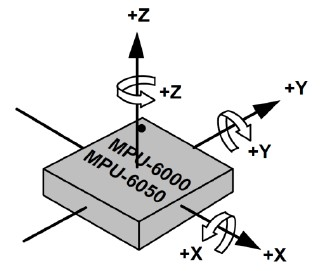
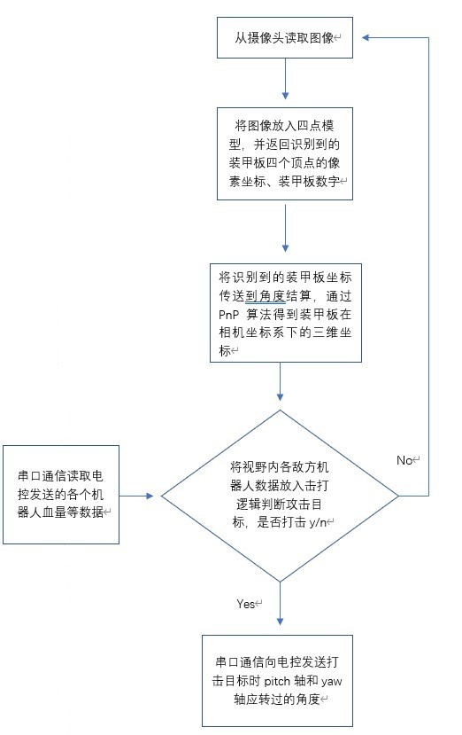
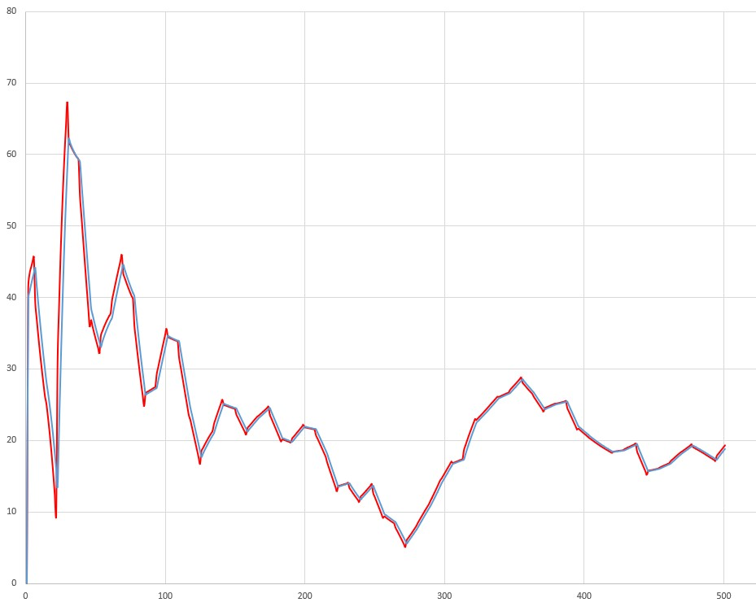
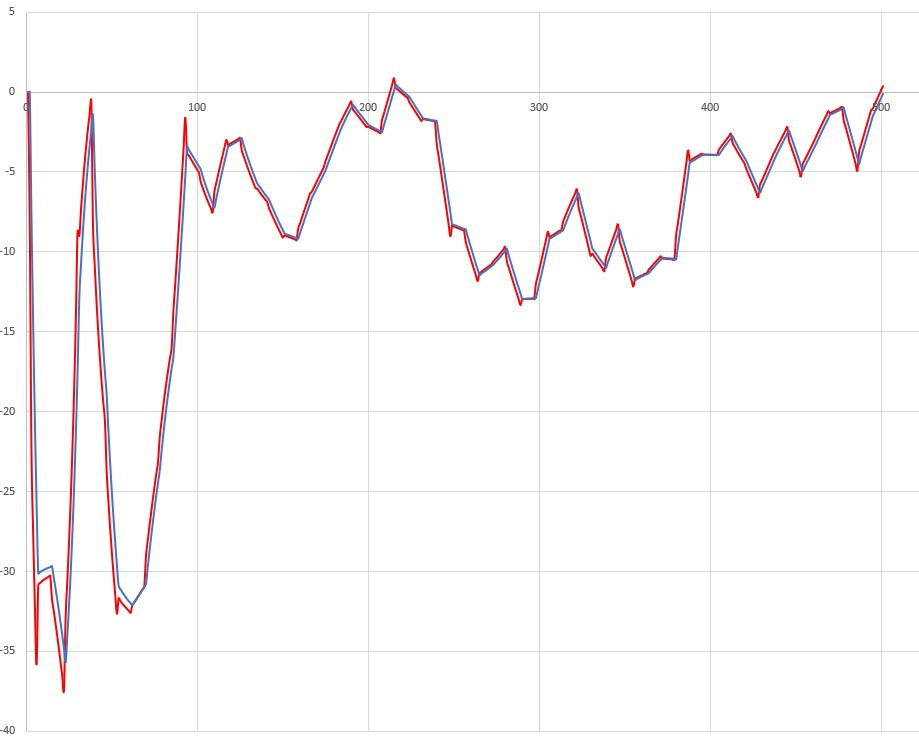

# 卡尔曼滤波_自瞄部分

作者：李轩		联系方式：are10032@outlook.com

## 简介

​	目前自瞄中使用的卡尔曼滤波是对云台此刻所对应的四元数进行滤波。相比于此前对相机坐标系下目标的运动状态进行滤波而言，对我方云台四元数滤波可以有效地避免我方机器人移动而导致目标运动模型的不匹配。

​	采用四元数的优点有：

1.四元数统一在四维空间中，容易对拟合出的曲线进行插值。

2.相比于描述由三个相对独立的角度组成的欧拉角的旋转，四元数的旋转更容易建立出一个简洁的状态转移方程。

## 预备知识

#### 一、欧拉角转四元数

本文中的坐标系与云台IMU所定义的右手坐标系相同以便于日后可能移植到电控的程序中，坐标系如下：

设绕$z$轴旋转角度为偏航角$yaw(\psi)$，绕$x$轴旋转角度为俯仰角$pitch(\phi)$，绕$y$轴旋转角度为翻滚角$roll(\varphi)$。

旋转顺序为$z-x-y$。$\times$表示四元数乘法，$*$表示普通乘法

欧拉角所对应的三维旋转角度$\alpha$，相应四元数在四维空间中旋转角度$\beta$，则$\alpha=2*\beta$。

设四元数$$q=\begin{bmatrix}a&b*i&c*j&d*k\end{bmatrix}$$，

$$q_x=\begin{bmatrix}cos(\frac{\phi}{2})&sin(\frac{\phi}{2})&0&0\end{bmatrix}$$

$$q_y=\begin{bmatrix}cos(\frac{\varphi}{2})&0&sin(\frac{\phi}{2})&0\end{bmatrix}$$

$$q_z=\begin{bmatrix}cos(\frac{\psi}{2})&0&0&sin(\frac{\psi}{2})\end{bmatrix}$$，则：$$q=z\times {x}\times{y}$$，

即：

$$a=cos(\frac{\phi}{2})*cos(\frac{\varphi}{2})*cos(\frac{\psi}{2})-sin(\frac{\phi}{2})*sin(\frac{\varphi}{2})*sin(\frac{\psi}{2})$$

$$b=sin(\frac{\phi}{2})*cos(\frac{\varphi}{2})*cos(\frac{\psi}{2})-cos(\frac{\phi}{2})*sin(\frac{\varphi}{2})*sin(\frac{\psi}{2})$$

$$c=cos(\frac{\phi}{2})*sin(\frac{\varphi}{2})*cos(\frac{\psi}{2})+sin(\frac{\phi}{2})*cos(\frac{\varphi}{2})*sin(\frac{\psi}{2})$$

$$d=cos(\frac{\phi}{2})*cos(\frac{\varphi}{2})*sin(\frac{\psi}{2})+sin(\frac{\phi}{2})*sin(\frac{\varphi}{2})*cos(\frac{\psi}{2})$$

#### 二、欧拉角转旋转矩阵

设欧拉角旋转形式为内旋

绕$$x$$轴旋转的旋转矩阵$$R_x$$为$$\begin{bmatrix}1&0&0 \\ 0&cos(\phi)&-sin(\phi) \\ 0&sin(\phi)&cos(\phi) \end{bmatrix}$$

绕$$y$$轴旋转的旋转矩阵$$R_y$$为$$\begin{bmatrix}cos(\varphi)&0&sin(\varphi) \\ 0&1&0 \\ -sin(\varphi)&0&cos(\varphi) \end{bmatrix}$$

绕$$z$$轴旋转的旋转矩阵$$R_z$$为$$\begin{bmatrix}cos(\psi)&-sin(\psi)&0 \\ sin(\psi)&cos(\psi)&0 \\ 0&0&1 \end{bmatrix}$$

欧拉角旋转矩阵为$R_z*R_x*R_y=$

$$\begin{bmatrix}cos(\psi)*cos(\varphi)-sin(\psi)*sin(\phi)*sin(\varphi)&-sin(\psi)*cos(\phi)&cos(\psi)*sin(\varphi)+sin(\psi)*sin(\phi)*cos(\varphi) \\ sin(\psi)*cos(\varphi)+cos(\psi)*sin(\phi)*cos(\varphi)&cos(\psi)*cos(\phi)&sin(\psi)*sin(\varphi)-cos(\psi)*sin(\phi)*cos(\varphi) \\ -cos(\phi)*sin(\varphi)&sin(\phi)&cos(\phi)*cos(\varphi) \end{bmatrix}$$

#### 三、四元数转旋转矩阵

由四元数乘法可得四元数对应旋转矩阵为$$\begin{bmatrix}a^2+b^2+c^2+d^2 & 2*b*c-2*a*d&2*b*d+2*a*c\\2*b*c+2*a*d&a^2-b^2+c^2-d^2&2*c*d-2*a*b \\2*b*d-2*a*c&2*c*d+2*a*b&a^2-b^2-c^2+d^2 \end{bmatrix}$$

#### 四、四元数转欧拉角

由欧拉角所得的旋转矩阵与四元数所得的旋转矩阵的对应关系可得：

$$\phi=arcsin(2*c*d+2*a*b)$$

$$\varphi=-arctan(\frac{2*b*d-2*a*c}{a^2-b^2-c^2+d^2})$$

$$\psi=-arctan(\frac{2*b*c-2*a*d}{a^2-b^2+c^2-d^2})$$

## 滤波器设计

#### 一、获取数据

​	电控发来的当前的$$pitch$$轴和$$yaw$$轴数据，由角度结算可得出将要转过的相对角度，再将这两个角度相加后转化为四元数。

#### 二、建立状态方程

设四元数$$Q=cos(\frac{\alpha}{2})+sin(\frac{\alpha}{2})*v$$，则对该四元数求导可得：

$$\dot{Q}=-sin(\frac{\alpha}{2})*\frac{\dot{\alpha}}{2}+v*cos(\frac{\alpha}{2})*\frac{\dot{\alpha}}{2}+\dot{v}sin(\frac{\alpha}{2})$$

$$=-sin(\frac{\alpha}{2})*\frac{\dot{\alpha}}{2}+v*cos(\frac{\alpha}{2})*\frac{\dot{\alpha}}{2}$$

$$=v\times{v}*\frac{\dot{\alpha}}{2}*sin(\frac{\alpha}{2})+v*cos(\frac{\alpha}{2})*\frac{\dot{\alpha}}{2}$$

$$=\frac{\dot{\alpha}}{2}*v*(cos(\frac{\alpha}{2})+sin(\frac{\alpha}{2})*v)$$

$$=\frac{\dot{\alpha}}{2}*v*Q$$

$$=\frac{1}{2}*{\omega}*Q$$

可得$Q_{k}=Q_{k-1}+\frac{1}{2}*\omega*Q_{k-1}*t$$

$=(I+\frac{1}{2}*\omega*t)*Q_{k-1}$$

$=A*Q_{k-1}$$

#### 三、加入约束条件

由单位四元数性质可得$$a^2+b^2+c^2+d^2=1$$。

可得约束条件$$g(Q)=1$$

$$g'(Q)=2*a+2*b+2*c+2*d$$

#### 四、滤波流程

#### 五、测试

测试代码上传至github（[TioeAre/quaternion: 基于四元数的卡尔曼滤波测试程序 (github.com)](https://github.com/TioeAre/quaternion)）

由于与电控组尚未完成对机器人的调试工作，目前采用仿真数据来测试滤波效果。数据为自定义的匀速运动并人为在$x,y,z$三轴各加入了$2cm$的随机误差以尽可能符合真实情况。

对$yaw$轴滤波效果如下：

横轴为滤波次数，纵轴为$yaw$轴角度。蓝色曲线为$yaw$轴的真实值，红色曲线为对$yaw$轴的预测值。

对$pitch$轴滤波效果如下：

横轴为滤波次数，纵轴为$pitch$轴角度。蓝色曲线为$pitch$轴的真实值，红色曲线为对$pitch$轴的预测值。

#### 六、优化方向

1.加入更多约束条件来提高效率 .

2.尝试将代码移植到电控程序中，从IMU直接获取所需的四元数和角速度以提高精度.

#### 七、参考资料

[untitled (csuohio.edu)](https://academic.csuohio.edu/simond/pubs/IETKalman.pdf)

[欧拉角四元数转换_空虚法师的博客-CSDN博客_欧拉角转四元数](https://blog.csdn.net/qq_15063463/article/details/82430103)

[四元数笔记（3）—— 轴角表示法与四元数表示的区别_罗伯特祥的博客-CSDN博客_轴角和四元数](https://blog.csdn.net/weixin_43455581/article/details/108413001)

[四元数、旋转矩阵、罗德里格斯参数及旋转矩阵对罗德里格斯参数偏导数 - 知乎 (zhihu.com)](https://zhuanlan.zhihu.com/p/377187741#:~:text=直接表达式对四元数求导： 设单位向量 所在坐标系的旋转角速度 ，根据欧拉求导法则： 由于 同向，所以上式为0。,根据四元数的乘法： 所以可以推出 这里取四元数的另一种表达方式 若将世界坐标系下角速度 用体坐标系下 来替代，需要进行坐标系转换 所以四元数的导数可以写成)

[三维旋转：欧拉角、四元数、旋转矩阵、轴角之间的转换 - 知乎 (zhihu.com)](https://zhuanlan.zhihu.com/p/45404840)

[四元数EKF姿态更新算法 - 知乎 (zhihu.com)](https://zhuanlan.zhihu.com/p/454155643)

[四元数对时间的导数 - 知乎 (zhihu.com)](https://zhuanlan.zhihu.com/p/395511536)

[[转\]四旋翼飞行器的姿态解算小知识点_as122343的博客-CSDN博客](https://blog.csdn.net/as122343/article/details/102256137)

[一步步推导由欧拉角到旋转矩阵的计算过程_DuYihao的博客-CSDN博客_欧拉角旋转矩阵的推导](https://blog.csdn.net/D_XingGuang/article/details/97148669)

张帆,曹喜滨,邹经湘.一种新的全角度四元数与欧拉角的转换算法[J].南京理工大学学报(自然科学版),2002(04):376-380.DOI:10.14177/j.cnki.32-1397n.2002.04.010.

程烺,俞家勇,马龙称,周茂伦,曹岳飞.单位四元数、罗德里格转换模型与欧拉角的映射关系[J].北京测绘,2020,34(01):44-50.DOI:10.19580/j.cnki.1007-3000.2020.01.009.
